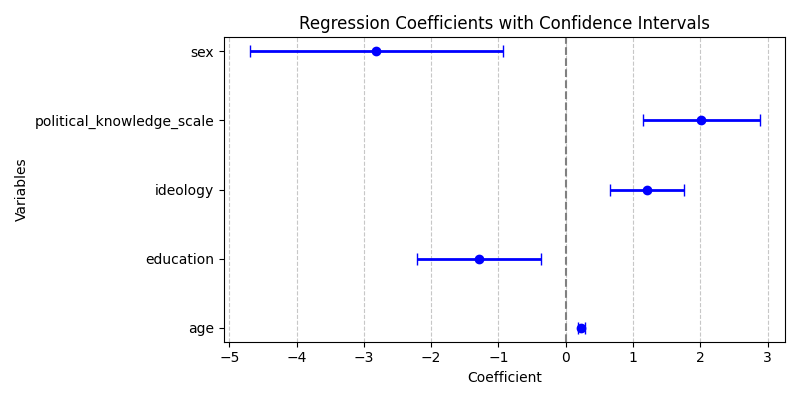

# From Explanations to Communication

## Agenda
- [ ] Theory
    - Presentation & Discussion
- [ ] Code 
    - Grouping, Summarising, and Visualizing
- [ ] Application
    - Project Visualization Hack-time

## Theory

### Presentation & Discussion

- [Chetty, R., Jackson, M. O., Kuchler, T., Stroebel, J., Hendren, N., Fluegge, R. B., ... & Wernerfelt, N. (2022). Social capital I: measurement and associations with economic mobility. *Nature*, 608(7921), 108-121.](https://www.nature.com/articles/s41586-022-04996-4.pdf)


## Code 

Visualizations are powerful tools for communicating research findings, and this module emphasizes creating visualizations to illustrate the impact of key variables within your research projects.

In this module, we will :

- learn how to perform grouped operations using the `.groupby()` method and how to `.merge()` different datasets. 
- create density plots to examine the distribution of variables, segmented by other factors.
- learn to visualize your analysis results, including creating a visualization .  


### Density Plots by Group

{width=50%}

```python
import seaborn as sns

sns.kdeplot(
   ax=ax, data=df, x="affective_polarization", hue="political_interest",
   fill=True, common_norm=False, palette="crest",
   alpha=.5, linewidth=0, 
)

```

### Creating Maps

{width=95%}


```python
import geopandas as gpd  # Load geospatial data package
import matplotlib.pyplot as plt

# Download and Load the US shape file to draw a map.
url = "https://raw.githubusercontent.com/holtzy/The-Python-Graph-Gallery/master/static/data/us_states_hexgrid.geojson.json"
map_us = gpd.read_file(url)
map_us['google_name'] = map_us['google_name'].str.replace(' (United States)','')
# Create summaries by state
state_polarization = df.groupby('state')['affective_polarization'].mean()
# Merge the two datasets and a similar key
map_us = map_us.merge(state_polarization, left_on='google_name', right_on='state', how='left')
# Creating and Adding Centroids to the dataset
map_us['centroid'] = map_us['geometry'].apply(lambda x: x.centroid)
# Initialize the figure
colors = "BuPu"
fig, ax = plt.subplots(1, figsize=(10, 5))
# map counties with the right color:
map_us.plot(
    ax=ax,
    column="affective_polarization", 
    cmap=colors,
    norm=plt.Normalize(vmin=0, vmax=100),
    edgecolor='black', 
    linewidth=.5
);
# Remove useless axis
ax.axis('off');
# Add title, subtitle and ...
ax.annotate('Affective Polarization in the US', xy=(10,420),  xycoords='axes pixels', horizontalalignment='left', verticalalignment='top', fontsize=14, color='black')
ax.annotate('You can add your question description here.', xy=(10,400),  xycoords='axes pixels', horizontalalignment='left', verticalalignment='top', fontsize=11, color='#808080')
ax.annotate('Some other random message', xy=(500,0),  xycoords='axes pixels', horizontalalignment='left', verticalalignment='top', fontsize=8, color='#808080')
# for each county, annotate with the county name located at the centroid coordinates 
for idx, row in map_us.iterrows():
    ax.annotate(
        text=row['iso3166_2'], 
        xy=row['centroid'].coords[0], 
        horizontalalignment='center', 
        va='center',
        color="white"
    )
# Add a color bar
sm = plt.cm.ScalarMappable(cmap=colors, norm=plt.Normalize(vmin=0, vmax=100))
fig.colorbar(sm, ax=ax, orientation="horizontal", aspect=50, fraction=0.01, pad=0 );
```

### Visualizing Regression Coefficients

Plotting regression coefficients with confidence intervals helps in understanding the significance of predictors.

{width=80%}

```python
# Create a DataFrame to hold the model coefficients and their statistics
coef_df = pd.DataFrame({
    'coef': model.params,  # Extract the coefficients from the model
    'lower_ci': model.conf_int()[0],  # Extract the lower bounds of the confidence intervals
    'upper_ci': model.conf_int()[1],  # Extract the upper bounds of the confidence intervals
    'pval': model.pvalues  # Extract the p-values for the coefficients
}).drop('Intercept')  # Drop the intercept to focus on the variables of interest

# Set up the figure for plotting
plt.figure(figsize=(8, 10))

# Plot error bars to represent the confidence intervals for each coefficient
plt.errorbar(
    coef_df['coef'],  # Coefficient values on the x-axis
    coef_df.index,  # Variable names on the y-axis
    xerr=(
        coef_df['coef'] - coef_df['lower_ci'],  # Calculate error bars for the lower confidence interval
        coef_df['upper_ci'] - coef_df['coef']  # Calculate error bars for the upper confidence interval
    ), 
    fmt='o',  # Use circle markers for the data points
    color='b',  # Set the color of the markers to blue
    elinewidth=2,  # Set the width of the error bars
    capsize=4  # Set the size of the caps on the error bars
)

# Add a vertical line at x=0 to indicate where coefficients are not significantly different from zero
plt.axvline(x=0, color='grey', linestyle='--')
# Add a title to the plot
plt.title('Regression Coefficients with Confidence Intervals')
# Label the x-axis as 'Coefficient'
plt.xlabel('Coefficient')
# Label the y-axis as 'Variables'
plt.ylabel('Variables')
# Add a grid to the plot for better readability, applying only to the x-axis
plt.grid(axis='x', linestyle='--', alpha=0.7)  # Dashed grid lines with some transparency for clarity
```

These visualizations will help in interpreting the results of our analyses and in communicating findings effectively.


## Application

Let's head to Github and open our codespace (text editor)

- [GitHub :fontawesome-brands-github:](https://github.com/)


## For next time
- :fontawesome-solid-triangle-exclamation: Start Wrapping-up your [**:fontawesome-regular-file-code: Project**](activities/project.md) 

