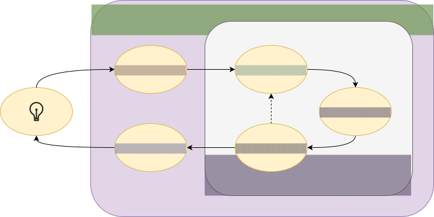

# From Insights to Visualization

## **Theory**
### Suggested Conceptual Reading & Discussion

- [Barber, M., and Jeremy C. Pope. (2019). Does Party Trump Ideology? Disentangling Party and Ideology in America. *American Political Science Review*, 113(1), 38–54.](https://www.cambridge.org/core/journals/american-political-science-review/article/does-party-trump-ideology-disentangling-party-and-ideology-in-america/B5BAD0AE947BD3CF18D51D399263C8D3)

## **Code: Live Demo & Hands-on Lab**

### :fontawesome-solid-chalkboard-user: Student Group Live Demo (Group 4)
- **Topic:** Filtering Survey Rows & Univariate Charts (Boolean masks, `.value_counts()`, distributions with Altair).
- Review the [Live Demo Guidelines & Schedule](../activities/participation.md#live-demo-schedule).

### The Data Science Pipeline

### Extracting Insights from Observations
!!! tip inline end
    To load and use a notebook in VS Code follow the steps 3 to 5 in [📘 Notebooks in VS Code](../resources/notebook-vscode.md)

- To start, download and open the notebooks directly in VS Code:
    - Get the [:fontawesome-solid-file-code: **Notebooks**](https://github.com/mickaeltemporao/materials/tree/main/notebooks) from the GitHub repository

## **Application**
### Start your Research Project Notebook
- In **VS Code**, create a new **Jupyter Notebook** (`.ipynb` file) to serve as the foundation for your research project.
- Begin developing and organising relevant code and analyses that contribute to your reproducible research paper (your final project).

## Get Ready for Next Session: Think. Explore. Practice.

### Think
- How do your DV and IV relate to each other when examined together? Think about whether your relationship is continuous-by-continuous (scatter plot), categorical-by-continuous (box/bar plot), or categorical-by-categorical (grouped frequency chart).
- What substantive story do your preliminary bivariate figures tell, and does it align with your original hypothesis?

### Explore
- **Live Demo (Group 5):** Visualizing Relationships with Altair. Group 5 prepares a 10–15 min demonstration and shares the handout on WhatsApp before class (groups can [book a meeting](https://cal.com/mickaeltemporao/1-1-meeting) with the instructor to get direction). The class should review the [Altair Bivariate Visualizations Gallery](https://altair-viz.github.io/gallery/index.html) to follow along and lead the peer discussion.
- **Suggested Reading:** [Panish, A. R. (2025). Informed or Overwhelmed? Disentangling the Effects of Cognitive Ability and Information on Public Opinion. *British Journal of Political Science*, 55, 1-24.](https://www.cambridge.org/core/journals/british-journal-of-political-science/article/informed-or-overwhelmed-disentangling-the-effects-of-cognitive-ability-and-information-on-public-opinion/75BE14D71B91D44CC700F93F37CDC398) — Highlights modern data visualization standards in political science for presenting survey interaction effects and group differences clearly.

### Practice
- Export your two Altair figures as images and integrate them with accompanying text into your Typst manuscript.
- :fontawesome-solid-award: **Complete [Milestone 3 - Exploration](../activities/milestone-3.md)** (Due Friday, Nov 20 at 23:59 via email).

