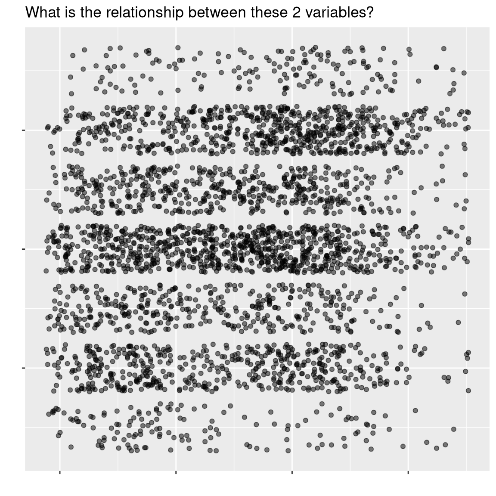
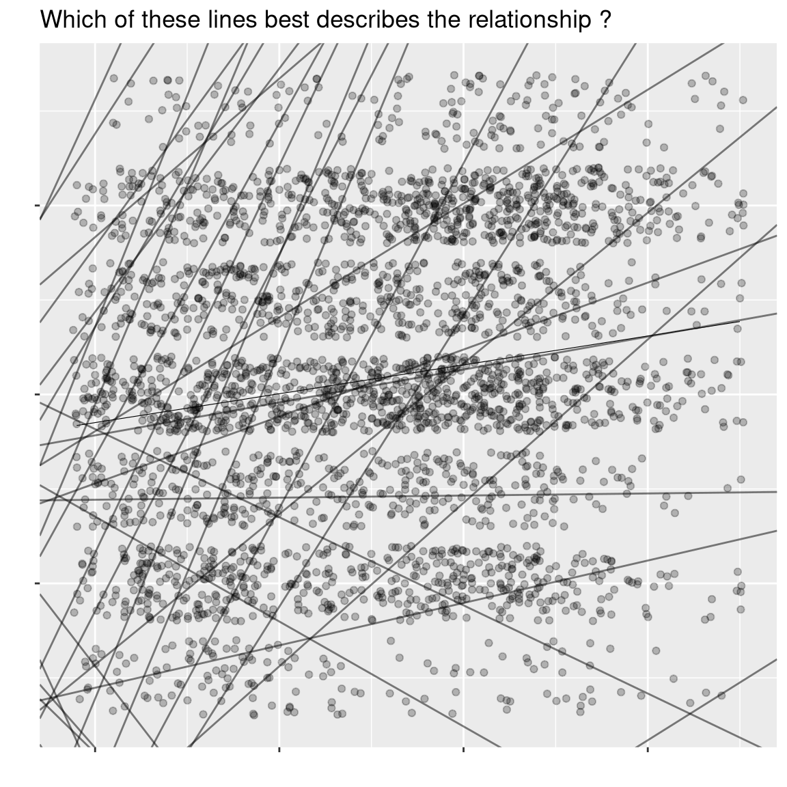
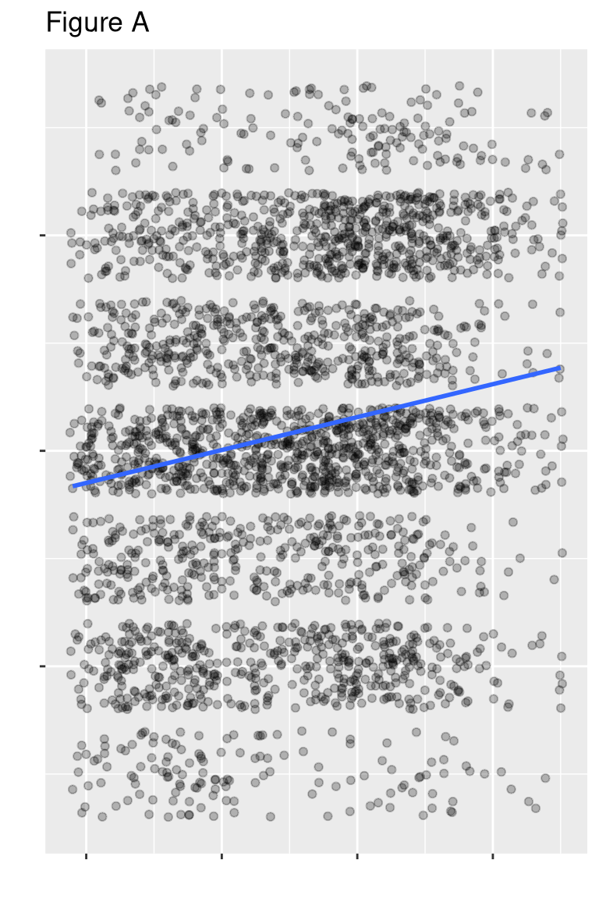
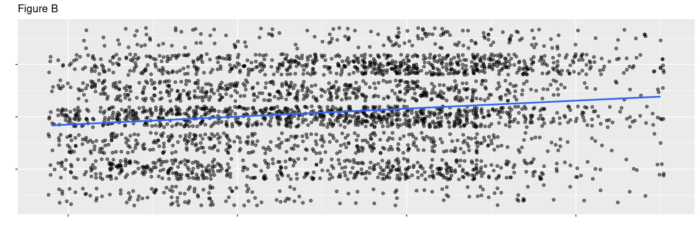
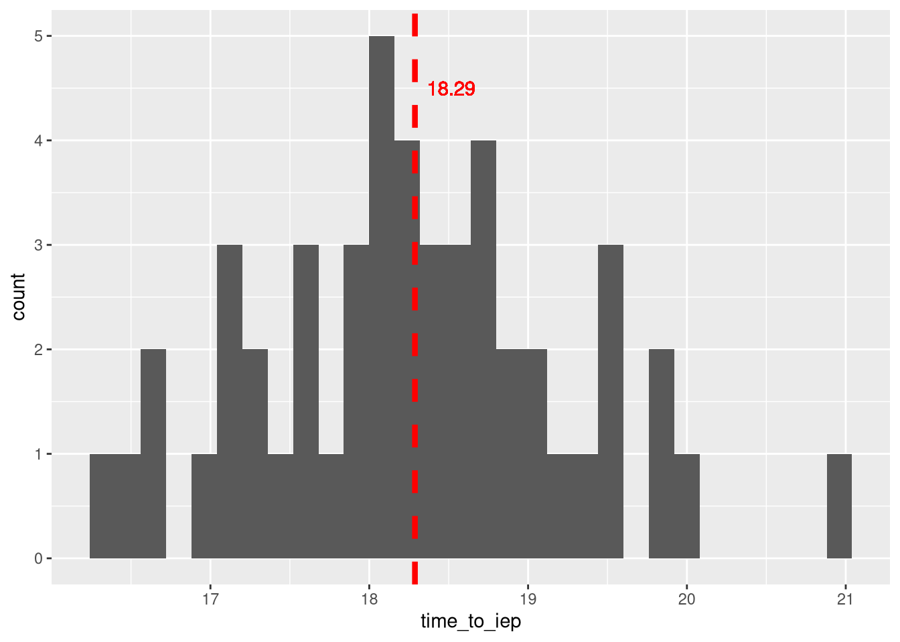

# From Transformations to Models
## Agenda

- [ ] Theory
    - What is a model?
    - Identify and quantify variable relationships
- [ ] Code
    - Build a Simple Model
- [ ] Application
    - Make Predictions Using your Model

## Theory

### Data Modeling

We have started to use data to answer questions using descriptive statistics such as `df['some_variable'].mean()`. We have also learned how to use visualizations to identify variable relationships and trends using `df[]()`. People often says that an image is worth a 1000 words. Images are a great tool to convey a message however, our perceptions can be biased [@lewandowsky1989perception]. Let's take a closer look.

#### Relationships between variables can be complex to see

{width=66%}

#### Adding random lines?
{width=66%}


#### Is it a Strong relationship?
{width=66%}
{width=66%}

#### Is the relationship observed due to random chance?

- To avoid such biases, we can quantify the strength of relationships using statistical models (e.g. Linear Regression)

## Code

### What is a model?

{width=66%}

```python
# Create data
my_data = pd.DataFrame({
    'time_to_iep': [16.93, 19.49, 18.21, 19.09, 17.67, 18.48, 16.37, 17.57, 19.18, 18.74, 17.15, 17.76, 17.2, 19.78, 18.34,
                    17.93, 18.09, 17.14, 19.41, 17.99, 16.54, 18.42, 16.65, 19.83, 18.32, 18.13, 16.72, 18.05, 18.5, 19.45,
                    17.22, 17.32, 19.48, 18.93, 18.69, 18.78, 18.58, 18.8, 18.28, 20.06, 18.12, 18.64, 18.16, 17.44, 18.96,
                    17.55, 19.09, 17.95, 21.01, 18.19]
})

# Visualize
my_data['time_to_iep'].plot.hist(alpha=0.5, bins=10)

# Add a vertical line at the mean
mean_value = my_data['time_to_iep'].mean()
plt.axvline(mean_value, color='red', linestyle='dashed', linewidth=3.5)
# Annotate the mean value on the plot
plt.text(mean_value, 4.5, f" {mean_value:.2f}", color='red', ha='left', fontsize=16)
plt.xlabel('Time to IEP')
plt.ylabel('Frequency')
plt.title('Histogram of Time to IEP')
```


## Application

Let's head to Github and open our codespace (text editor)

- [GitHub :fontawesome-brands-github:](https://github.com/)


## For Next Time

- :fontawesome-solid-brain: Use `statsmodels` to create a model related to your final project.
- :fontawesome-solid-book: Mandatory Reading, Note, & Presentation
    - [Pradel, F., Zilinsky, J., Kosmidis, S., & Theocharis, Y. (2024). Toxic speech and limited demand for content moderation on social media. *American Political Science Review*, 1-18.](https://www.cambridge.org/core/services/aop-cambridge-core/content/view/405333D7072585903E81BEF1729378F8/S000305542300134Xa.pdf/toxic-speech-and-limited-demand-for-content-moderation-on-social-media.pdf)


