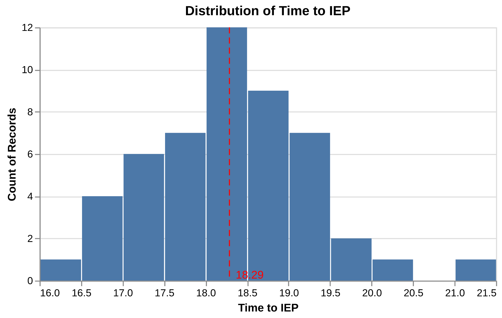

# From Hypotheses to Models

This module introduces the fundamental concepts of **statistical modeling** in political science research. We have already explored our data, visualized distributions, and examined relationships between variables. Now, we ask:

* How can we formalize patterns in data?
* How can we make confident claims that go beyond mere observation?


Modeling is the bridge between **descriptive insights** and **data-driven inference**. It allows us to quantify uncertainty, test hypotheses, and predict outcomes. Think of models as tools that help you reason rigorously about your data instead of relying solely on intuition.

By the end of this module, you will have a conceptual understanding of modeling and practical skills to begin building your first statistical models.

## **Theory**

### Suggested Conceptual Reading & Discussion

- [Argyle, L. P., Busby, E. C., Fulda, N., Gubler, J. R., Rytting, C., & Wingate, D. (2023). Out of one, many: Using language models to simulate human samples. *Political Analysis*, 31(3), 337-351.](https://www.cambridge.org/core/services/aop-cambridge-core/content/view/035D7C8A55B237942FB6DBAD7CAA4E49/S1047198723000025a.pdf/out_of_one_many_using_language_models_to_simulate_human_samples.pdf)

### What is a Model?

A **model** is a simplified representation of reality that allows us to:

1. Summarize relationships between variables
2. Estimate effects while accounting for uncertainty
3. Make predictions for new data

For example, let's say we recorded the time I take to come to the *Sciences Po Bordeaux*. You might ask: *What is the actual time I take to come to work?* 

{ width=80% .center }

## **Code: Live Demo & Hands-on Lab**

### :fontawesome-solid-chalkboard-user: Student Group Live Demo (Group 3)
- **Topic:** Linear Regression & Categorical Predictors (Specifying `DV ~ IV`, adding `C(category)`, interpreting slopes, reference levels & R²).
- Review the [Live Demo Guidelines & Schedule](../activities/participation.md#live-demo-schedule).

### Modeling with Words


Even without code, practice **conceptual modeling**:

1. Identify your outcome variable (dependent variable) - Y (here it's `time_to_iep`)
2. Identify potential predictors (independent variables) - Xs
3. Ask: *How do other predictors explain variation in outcomes?*

> Conceptual modeling is essential before jumping to formulas. Models without theory are often misleading.

{ width=100% .center }

#### Common pitfalls to avoid

- Modeling before understanding the data
- Neglecting measurement validity 
- Misinterpreting statistical significance

#### Code to reproduce the figure

```python
# !pip install "altair[all]"
import altair as alt
import pandas as pd

df = pd.DataFrame(
    {
        'time_to_iep': [
            16.93, 19.49, 18.21, 19.09, 17.67, 18.48, 16.37, 17.57, 19.18,
            18.74, 17.15, 17.76, 17.2, 19.78, 18.34, 17.93, 18.09, 17.14,
            19.41, 17.99, 16.54, 18.42, 16.65, 19.83, 18.32, 18.13, 16.72,
            18.05, 18.5, 19.45, 17.22, 17.32, 19.48, 18.93, 18.69, 18.78,
            18.58, 18.8, 18.28, 20.06, 18.12, 18.64, 18.16, 17.44, 18.96,
            17.55, 19.09, 17.95, 21.01, 18.19
        ]
    }
)

mean_val = df["time_to_iep"].mean()

hist = alt.Chart(df, title="Distribution of Time to IEP").mark_bar().encode(
    x=alt.X("time_to_iep:Q", bin=alt.Bin(maxbins=10), title="Time to IEP"),
    y="count()"
)

mean_line = alt.Chart(pd.DataFrame({"x":[mean_val]})).mark_rule(
    color="red", strokeDash=[6,4]
).encode(x="x:Q")

mean_text = alt.Chart(pd.DataFrame({"x":[mean_val]})).mark_text(
    text=f"{mean_val:.2f}",
    dx=20, dy=250, color="red"
).encode(x="x:Q", y=alt.value(0))

hist + mean_line + mean_text
```

## Application

We will work from **[Notebook 7](https://github.com/mickaeltemporao/materials/tree/main/notebooks)**. 

!!! tip inline end
    To load and use a notebook in VS Code, follow steps 3 to 5 in
    [📘 Notebooks in VS Code](../resources/notebook-vscode.md)

Focus on *understanding how each IV (predictors) is related to the DV (outcome)*. Ask yourself:

- How does each variable help me explain the outcome (DV)?
- What is the causal mechanism behind it? 
- What is the hypothetical direction of the effect (+/-)?

---

## Get Ready for Next Session: Think. Explore. Practice.

### Think
- What happens to your primary coefficient ($\beta_1$) when you introduce demographic and political controls in nested model specifications? Does your finding survive controlling for confounders?
- How will you format and present nested regression models in an academic publication-ready table in Typst?

### Explore
- **Live Demo (Group 4):** Multiple Regression & Exporting Tables. Group 4 prepares a 10–15 min demonstration and shares the handout on WhatsApp before class (groups can [book a meeting](https://cal.com/mickaeltemporao/1-1-meeting) with the instructor to get direction). The class should review the [Typst Table Formatting Documentation](https://typst.app/docs/reference/model/table/) to follow along and lead the peer discussion.
- **Suggested Reading:** [King, G., Tomz, M., & Wittenberg, J. (2000). Making the most of statistical analyses: Improving interpretation and presentation. *American Journal of Political Science*, 44(2), 347-361.](https://gking.harvard.edu/files/gking/files/making.pdf) — The seminal classic on converting raw statistical regression output into meaningful, substantive quantities of interest for social science readers.

### Practice
- Fit your nested regression models in Python and generate your final Typst regression table.
- :fontawesome-solid-award: **Complete [Milestone 5 - Modeling](../activities/milestone-5.md)** (Due Friday, Mar 05 at 08:00 before class via email).


